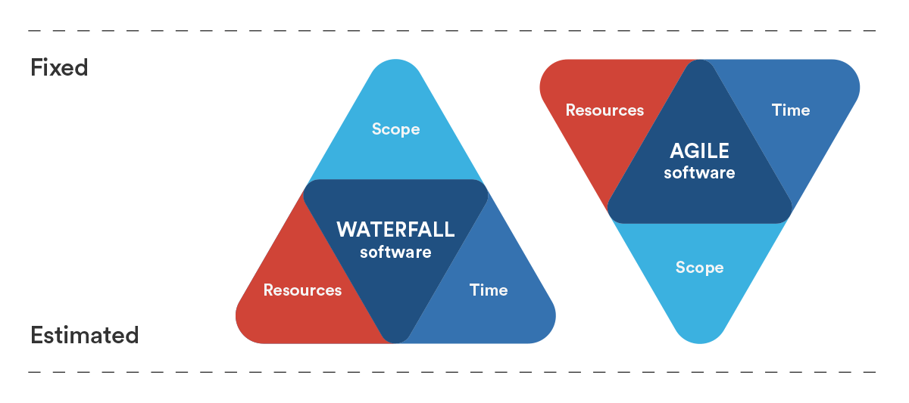

# Let's Get Started

---
@title[Introducing Rob]
@snap[west]
@css[bio-about]
Software Developer 
Project Manager 
Service Delivery Manager 
Product Owner 
Scrum Master 
Agile Coach 
Agile Transformation Lead 
Agile Transformation Manager 
@snapend

@snap[north-east bio]
@css[bio-headline](@fa[github pad-fa]RobertBarrow)
 
@css[bio-byline](@fa[twitter pad-fa]SquidVicious_UK)
 

@snapend

---
@title[Rob knows...]

@snap[west span-50]
@quote[Delivering working software](28 years)
@snapend

@snap[north span-100 fragment]
@quote[Using Lean / Agile methodologies ~ inc. Scrum](8 years)
@snapend

@snap[east span-50 fragment]
@quote[Coaching Agile transformation](5 years)
@snapend

@snap[south span-100 fragment]
@quote[Product & service management](8 years)
@snapend

---
@title[Biggest challenges in Software Development]
@snap[north-west]
### Biggest challenges in any software development
@snapend

@snap[west span-55]
@ul[spaced text](false)
- Time to market
- Competition (global)
- Return on investment
- Risk mitigation
- Predictability
@ulend
@snapend

---?image=assets/images/manifesto_background.jpg
@title[Agile Manifesto]
@snap[north span-100]
@size[0.8em](We are uncovering better ways of developing software by doing it and helping others do it.)
 
@size[0.8em](Through this work we have come to value:)
@snapend

@ul
- **Individuals & interactions** over processes & tools
- **Working software** over comprehensive documentation
- **Customer collaboration** over contract negotiation
- **Responding to change** over following a plan
@ulend

@snap[south span-100]
@size[0.8em](That is, while there is value in the items on the right,)
@size[0.8em](we value the items on the left more.)
@snapend

---
@title[The Iron Triangle]
@snap[north]
Invert the "iron triangle"
@snapend

---
@title[Agile Metrics]
@snap[north-west]
# Agile Metrics
@snapend

@snap[west span-100]
@ul[spaced text](false)
- Burndown ~ to measure progress
- Velocity ~ to provide predictablity
- *Cumulative flow* ~ increasing predictability
@ulend
@snapend

---
@title[Agile Metrics]
# Burndown charts

---
@title[Sprint Burndown chart]
## Sprint Burndown chart

<canvas data-chart="line">
<!-- 
{
 "data": {
  "labels": ["Day 1","Day 2","Day 3","Day 4","Day 5","Day 6","Day 7","Day 8","Day 9","Day 10"],
  "datasets": [
   {
    "data":[60,53,47,39,33,27,22,15,9,2],
    "label":"Story points remaining","backgroundColor":"rgba(20,120,120,.8)",
    "fill": true
   }
  ]
 }, 
 "options": { "responsive": "true" }
}
-->
</canvas>

---
@title[Epic Burndown chart]
## Epic Burndown chart

<canvas data-chart="line">
<!-- 
{
 "data": {
  "labels": ["Sprint 1","Sprint 2","Sprint 3","Sprint 4","Sprint 5","Sprint 6","Sprint 7","Sprint 8","Sprint 9","Sprint 10"],
  "datasets": [
   {
    "data":[307,247,194,147,108,75,48,26,11,2],
    "label":"Story points remaining","backgroundColor":"rgba(20,220,220,.8)",
    "fill": true
   }
  ]
 }, 
 "options": { "responsive": "true" }
}
-->
</canvas>

---
@title[Effort based velocity]
## Velocity 

---
@title[Story Points Delivered]
### Story points delivered
<canvas data-chart="line">
<!-- 
{
 "data": {
  "labels": ["Sprint 0","Sprint 1"," Sprint 2","Sprint 3","Sprint 4","Sprint 5","Sprint 6","Sprint 7","Sprint 8","Sprint 9","Sprint 10"],
  "datasets": [
   {
    "data":[0,59,61,60,61,58,59,60,58,60,59],
    "label":"Story points","backgroundColor":"rgba(20,220,220,.8)",
    "fill": true
   }
  ]
 }, 
 "options": { "responsive": "true" }
}
-->
</canvas>

---
@title[Average Velocity]
### Average Velocity
<canvas data-chart="line">
<!-- 
{
 "data": {
  "labels": ["Sprint 0","Sprint 1"," Sprint 2","Sprint 3","Sprint 4","Sprint 5","Sprint 6","Sprint 7","Sprint 8","Sprint 9","Sprint 10"],
  "datasets": [
   {
    "data":[0,29.5,40,45,48.2,49.83,51.14,52.25,52.88,53.6,54.09],
    "label":"Average Velocity","backgroundColor":"rgba(220,120,120,.8)",
    "fill": false
   },
   {
    "data":[0,59,61,60,61,58,59,60,58,60,59],
    "label":"Story points","backgroundColor":"rgba(20,220,220,.8)",
    "fill": true
   }
  ]
 }, 
 "options": { "responsive": "true" }
}
-->
</canvas>

---
@title[Rolling Average]
### Rolling Average
<canvas data-chart="line">
<!-- 
{
 "data": {
  "labels": ["Sprint 0","Sprint 1"," Sprint 2","Sprint 3","Sprint 4","Sprint 5","Sprint 6","Sprint 7","Sprint 8","Sprint 9","Sprint 10"],
  "datasets": [
   {
    "data":[0,59,60,60,60.25,59.8,59.67,59.83,59.33,59.33,59],
    "label":"Rolling Average","backgroundColor":"rgba(120,120,120,.8)",
    "fill": false
   },
   {
    "data":[0,59,61,60,61,58,59,60,58,60,59],
    "label":"Story points","backgroundColor":"rgba(20,220,220,.8)",
    "fill": true
   }
  ]
 }, 
 "options": { "responsive": "true" }
}
-->
</canvas>

@snap[south span-100 fragment]
@size[0.5em](High tide:*61*, Average:*59*, Low tide:*58*)
@snapend

---
@title[Cone of Uncertainty]
### Cone of Uncertainty
<canvas data-chart="line">
<!-- 
{
 "data": {
  "labels": ["Sprint n+1"," Sprint n+2","Sprint n+3","Sprint n+4","Sprint n+5","Sprint n+6","Sprint n+7","Sprint n+8","Sprint n+9","Sprint n+10"],
  "datasets": [
   {
    "data":[2,4,6,8,10,12,14,16,18,20],
    "label":"High watermark","backgroundColor":"rgba(80,200,120,0.8)",
    "fill": false
   },
   {
    "data":[0,0,0,0,0,0,0,0,0,0,0],
    "label":"Average","backgroundColor":"rgba(120,120,120,0.8)",
    "fill": false
   },
   {
    "data":[-1,-2,-3,-4,-5,-6,-7,-8,-9,-10],
    "label":"Low watermark","backgroundColor":"rgba(255,36,0,0.8)",
    "fill": true
   }
  ]
 }, 
 "options": { "responsive": "true" }
}
-->
</canvas>

---
@title[Cumulative Flow]
### Cumulative Flow
<canvas data-chart="line">
<!-- 
{
 "data": {
  "labels": ["Sprint 0","Sprint 1"," Sprint 2","Sprint 3","Sprint 4","Sprint 5","Sprint 6","Sprint 7","Sprint 8","Sprint 9","Sprint 10"],
  "datasets": [
   {
    "data":[0,60,159,261,360,461,558,659,760,858,960],
    "label":"Delivered","backgroundColor":"rgba(00,168,107,.8)"
   },
   {
    "data":[0,100,200,300,400,500,600,700,800,900,1000],
    "label":"In progress","backgroundColor":"rgba(120,120,120,.8)"
   },
   {
    "data":[60,159,261,360,461,760,760,760,858,960,1059],
    "label":"Backlog","backgroundColor":"rgba(20,220,220,.8)"
   }
  ]
 }, 
 "options": { "responsive": "true" }
}
-->
</canvas>

---
@title[Epic Burndown chart]
## Epic Burndown chart

<canvas data-chart="line">
<!-- 
{
 "data": {
  "labels": ["Sprint 1","Sprint 2","Sprint 3","Sprint 4","Sprint 5","Sprint 6","Sprint 7","Sprint 8","Sprint 9","Sprint 10"],
  "datasets": [
   {
    "data":[307,247,194,147,108,75,48,26,11,2],
    "label":"Story points remaining","backgroundColor":"rgba(20,220,220,.8)",
    "fill": true
   }
  ]
 }, 
 "options": { "responsive": "true" }
}
-->
</canvas>

---
@title[Value based velocity]
### Value based velocity
<canvas data-chart="line">
<!-- 
{
 "data": {
  "labels": ["Sprint 0","Sprint 1"," Sprint 2","Sprint 3","Sprint 4","Sprint 5","Sprint 6","Sprint 7","Sprint 8","Sprint 9","Sprint 10"],
  "datasets": [
   {
    "data":[0,8,58,60,61,56,47,30,20,10,5],
    "label":"Epic A","backgroundColor":"rgba(220,120,120,.8)"
   }
  ]
 }, 
 "options": { "responsive": "true" }
}
-->
</canvas>

---
@title[The "iceberg" effect]
### The "iceberg effect"
<canvas data-chart="line">
<!-- 
{
 "data": {
  "labels": ["Sprint 0","Sprint 1"," Sprint 2","Sprint 3","Sprint 4","Sprint 5","Sprint 6","Sprint 7","Sprint 8","Sprint 9","Sprint 10"],
  "datasets": [
   {
    "data":[0, 8,58,60,61,56,47,30,20,10, 5],
    "label":"Epic A","backgroundColor":"rgba(220,120,120,.8)"
   },
   {
    "data":[0,59,61,60,61,58,59,60,58,60,59],
    "label":"Story points","backgroundColor":"rgba(20,220,220,.8)"
   }
  ]
 }, 
 "options": { "responsive": "true" }
}
-->
</canvas>

---
@title[Rolling Epics]
### Rolling Epics
<canvas data-chart="line">
<!-- 
{
 "data": {
  "labels": ["Sprint 0","Sprint 1"," Sprint 2","Sprint 3","Sprint 4","Sprint 5","Sprint 6","Sprint 7","Sprint 8","Sprint 9","Sprint 10"],
  "datasets": [
   {
    "data":[0, 0, 0, 0, 0, 0, 8,57,58,60,59],
    "label":"Epic B","backgroundColor":"rgba(220,120,120,.8)"
   },
   {
    "data":[0, 8,58,60,61,56,47, 3, 0, 0, 0],
    "label":"Epic A","backgroundColor":"rgba(120,120,120,.8)"
   },
   {
    "data":[0,59,61,60,61,58,59,60,58,60,59],
    "label":"Story points","backgroundColor":"rgba(20,220,220,.8)"
   }
  ]
 }, 
 "options": { "responsive": "true" }
}
-->
</canvas>

---
@title[Scrum Events]
@snap[north-west]
## Scrum Events
@snapend

@snap[west span-55]
@ul[spaced text](false)
- Sprint Planning
- Daily Stand-up
- Sprint Review
- Retrospective
- *Backlog Refinement*
@ulend
@snapend

---
@title[Scrum Event Schedule]
@snap[north-west span-100]
<table>
  <tr>
    <th>Sprint Event</th>
    <th>Occurs</th>
    <th>Duration *</th>
  </tr>
  <tr>
    <td>Planning</td>
    <td>At the start each Sprint</td>
    <td>2-4 hours</td>
  </tr>
  <tr class="fragment">
    <td>Daily Scrum</td>
    <td>Every day</td>
    <td>15 minutes</td>
  </tr>
  <tr class="fragment">
    <td>Increment Review</td>
    <td>At the end of each Sprint</td>
    <td>1-2 hours</td>
  </tr>
  <tr class="fragment">
    <td>Team Retrospective</td>
    <td>Between Sprints</td>
    <td>1-2 hours</td>
  </tr>
</table>
@snapend

@snap[south-east span-100 fragment]
@size[0.5em](* Based on a two-week Sprint. Note: your mileage may vary!)
@snapend

---
@title[Facilitators & Attendees]
## Facilitators & Attendees

---
@title[Scrum Event Facilitation & Attendees]
@snap[north-west span-100]
<table>
  <tr>
    <th>Sprint Event</th>
    <th>Product Owner</th>
    <th>Scrum Master</th>
    <th>Scrum Team</th>
    <th>Stakeholders</th>
  </tr>
  <tr>
    <td>Planning</td>
    <td>Req'd</td>
    <td>Facilitator</td>
    <td>Req'd</td>
    <td></td>
  </tr>
  <tr>
    <td>Daily</td>
    <td>Optional</td>
    <td>Optional</td>
    <td>Req'd</td>
    <td>Optional</td>
  </tr>
  <tr>
    <td>Review</td>
    <td>Facilitator</td>
    <td>Req'd</td>
    <td>Req'd</td>
    <td>Attendees</td>
  </tr>
  <tr>
    <td>Retro</td>
    <td>Optional</td>
    <td>Facilitator</td>
    <td>Required</td>
    <td></td>
  </tr>
  <tr>
    <td>Backlog</td>
    <td>Facilitator</td>
    <td>Required</td>
    <td>Optional</td>
    <td></td>
  </tr>
</table>
@snapend

@snap[south span-100]
@size[0.5em](SP=Sprint Planning, DS=Daily Stand-up, SR=Sprint Review, TR=Team Retrospective, BR=Backlog Refinement)
@snapend

---
@title[Focus]
@snap[north]
The three roles in Scrum...
@snapend
@snap[west span-100]
@size[0.9em](**Product Owner** ~ focused on **VALUE** delivered )
@size[0.9em](**Delivery Team** ~ focused on **OUTCOMES** achieved )
@size[0.9em](**Scrum Master** ~ focused on **CONTINUOUS** improvement)
@snapend

---
